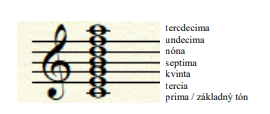
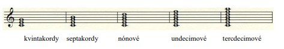
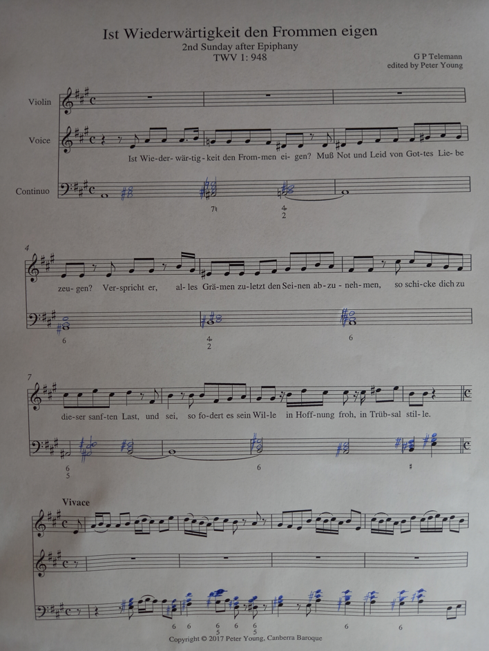
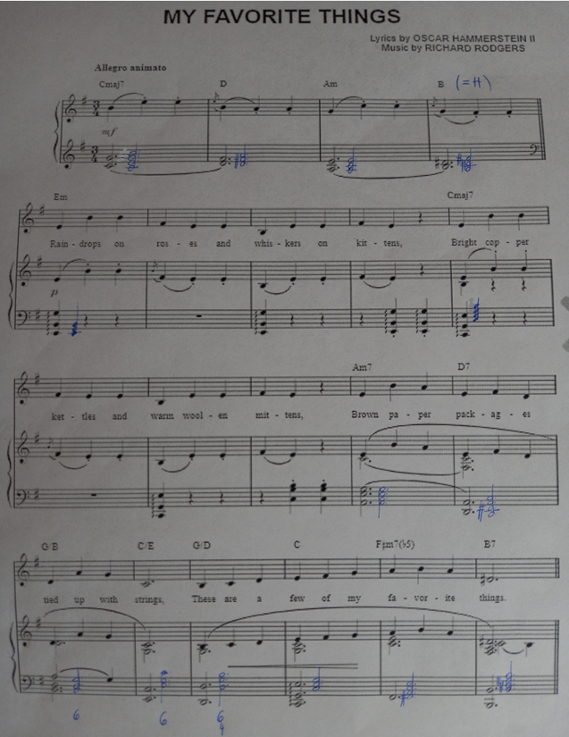

# Maturitné témy Hudba Spev

*** 

## Téma č.1

**Názov témy:** ČAS A POHYB V HUDBE

- **a)**
  - Vysvetlite pojmy rytmus, metrum, takt, tempo a ich zaznamenávanie v notovom zápise.
- 

    
Vypracovanie

  - **Rytmus –** dĺžka nôt, vzájomné pomery dĺžok (celá, polová, štvrťová... + pomlčky), pravidelné delenie – polová = 2 štvťové atď. , nepravidelné delenie (polová = 3 štvťové, 5 osminových, 7 šestnástinových ...)

  - **Metrum –** striedanie prízvučných a neprízvučných dôb napr. 1 prízvučná a 2 neprízvučné doby = 3-dobý takt. Metrum je v zápise vyjadrené **taktovým predznamenaním  - .** napr. 3/8 – 3 doby (1. prízvučná, 2. a 3. neprízvučná), 1 doba = osminová nota. **párne a nepárne metrum**

  - **Takt –** metro-rytmická jednotka, ohraničená taktovou čiarou.

    - **jednoduché** (majú 1 prízvučnú dobu – napr. ¾, 2/4...)

    - **zložené** (majú 2 a viac prízvukov  - napr. 4/4, 6/8 a pod.)

  - **Tempo –** rýchlosť pulzácie dôb, zapisuje sa
    1. talianskym názvoslovím na začiatku skladby (rýchle tempá – Presto, Vivace, Allegro... stredné tempá: Moderato, Andante... pomalé tempá: Largo, Adagio, Grave...),
    2. udaním počtu úderov za minútu na jednu rytmickú jednotku: napr. 1 štvrťová = 120 MM (Meltzelov metronóm) alebo BPM (Beats per minute)
    3. durata (celkové trvanie skladby) – na konci skladby je napr. Durata: 3´45´´ t.j. skladba sa má zahrať za 3 minúty a 45 sekúnd

    - Počas skladby sa môže tempo meniť, ak pod príslušným úsekom skladby je
      - *acc. / accel./ accellerando* alebo *stringendo* (zrýchľovanie)
      - *rit. /ritenuto/ ritardando* alebo *rallentando* (spomaľovanie, zvoľnenie) prípadne aj *dim./ diminuendo* stišovanie spolu so spomalením.

  
 

- **b)**
  - Charakterizujte formu suity a suitového cyklu.
  - Na základe notového príkladu popíšte metro-rytmickú idiomatiku a tempové charakteristiky jednotlivých tancov barokovej suity.
- 

    
Vypracovanie

  1. **Suita, suitový cyklus –** rad tancov alebo výber inštrumentálnej hudby z hudobno-dramatických diel (z baletu, muzikálu, scénickej alebo filmovej hudby a pod.), prípadne konceptuálny album (v jazze, v rocku a pod.).

      - **V baroku** sa používal aj pojem *ordre, partie, partita, ouverture...*

      - Môže obsahovať aj netanečné časti (prelúdium, ouverture...)

      - **Rozdiel medzi** **suitovým a sonátovým cyklom je, že sonátový cyklus musí mať aspoň 1 časť v sonátovej forme!**

  2. **Barokové tance -** líšia sa tempovo (pomalé, rýchle), metricky (párne, nepárne), či majú alebo nemajú predtaktie, formovou štuktúrou (napr. pravidelné 8-taktia, alebo nepravidelné) a celkovou rytmickou idiomatikou (použitie sominovej pulzácie, prvá doba je dlhá hodnota a pod.), prípadne faktúrou (napr. gigue býva polyfónny, sarabanda býva kolorovaná ária a pod.). V barokových suitách je jednotiacim prvkom tónina, niekedy aj motivicko-tematický materiál – technika tzv. proportio* (hudba zostáva, zmení sa tempo a metrum)

      - *allemande –* štvordobý tanec mierneho tempa s predtaktím, prvá doba je ležiaca, s drobnými rytmickými hodnotami vo figurácii (osminy, šestnástiny)

      - *courante –* trojdobý, rýchlejší s predtaktím, objavujú sa často hemioly v kadenciách. (zmeny metra napr. zo 6/8 na ¾ - vo vnútri, nezapísané)

      - *sarabanda  -* trojdobý, veľmi pomalý, bez predtaktia. striedajú sa prízvuky na 1. a 2. dobu v takte. Často ako kolorovaná ária.

      - *gigue –* trojdobý, veľmi rýchly, s predtaktím alebo bez, najčastejšie ako 6/8 alebo 12/8 takt, imitačne vedené hlasy.

      - *menuet –* trojdobý, mierne tempo, bez predtaktia, pravidelná štruktúra, štrvťová alebo osminová pulzácia

      - *gavotte –* 4/4, mierne rýchly, 2 štvťové noty ako predtaktie, na začiatku taktu polová hodnota (môže byť aj akordický rozklad s ležiacou harmóniou)

      - *bourrée –* rýchlejší, 4- dobý so štvrťovým predtaktím.

      - *siciliano –* 12/8 s predtaktím, s bodkovaným rytmom, mierneho až pomalého tempa

    ďalšie tance – *canarie, loure, passacaglia, ciaccona (chaconne), folia, passamezzo, chorea (všeobecný názov pre tanec), polonaise...*

    v období klasicizmu nastal útlm v tvorbe suít, z inštrumentálnej hudby ju vytlačili skladby na báze sonátového cyklu (sonáty, serenády, divertimentá, sláčikové kvartetá, dychové kvintetá ...)

    pojem suita sa objavuje v období 19. st. (romantizmus) vo význame  „hudba z baletu, scénická hudba...“

  
 

- **c)**
  - Načrtnite význam tancov a tanečnej hudby dejinách hudobnej tvorby.
  - Vymenujte skladateľov, ktorí sa venovali tvorbe tancov, suít, štylizovaných tancov a baletov. Uveďte príklady z ich tvorby.
- 

    
Vypracovanie

  - **Tanec a tanečná hudba** mali v minulosti nízke postavenie medzi umeniami – úžitková hudba, **od stredoveku** málo záznamov hudby (tance saltarello, lai, ballata, estampie...)

  - **V renesancii** – Urpaar (pôvodný pár – **pavane –** pomalý tanec 4 -dobý – polová, 2 štvrťové a **gagliarde –** rýchly 3-dobý) technika *proportio* – rovnaký hudobný materiál. Ďalšie tance – *venetiana, bransle ...* Prvé učebnice tanca (Arbeau), prvé tanečné zbierky (Attaignant, Susato...)

  - **Baroko –** viď vyššie. Vo Francúzsku vzniká za Ľudovíta XIV. Akadémia tanca – pravidlá tanca.
    - Vzniká ***Ballet de cour*** (tanec – alegorické postavy, básnický prednes – komentár, vokálna a inštrumentálna hudba - Lully), ***comédie-ballet*  -** spolupráca Moliére – Lully (divadelná komédia s tancami a pesničkami), ***opéra-ballet***  - spev s baletmi (Rameau). **Inštrumentálne suity** – pre orchester alebo sólové nástroje (Couperin, Rameau, Händel, Bach, Muffat...)

  - **Klasicizmus** – Menuet ako súčasť sonátového cyklu, už sa netancoval v tom čase;
    - Salónna hudba - klavírne štylizácie tancov – Menuet, Eccossaise, Ländler, Polonaise, Walzer...Beethoven, Haydn, Mozart... prvé dejové balety (*La Fille mal gardée –* Zle strážené dievča, alebo Márna opatrnosť) – hudba k baletom je málo dôležitá, býva to *pasticcio* -t.j. je zostavená z rôznej vtedy populárnej hudby a melódií od rôznych autorov.
    - **Beethoven**: balet Prometheove stvorenia (dejový balet)

  - **Romantizmus – balet –** dôležitosť hudby: Adolphe Adam: Gisele, Ludwig Minkus: Don Quijote, Čajkovskij – Labutie jazero, Spiaca krásavica, Luskáčik...

  - **Suity ako scénická hudba:** Mendelssohn – Sen noci svätojánskej, Grieg – Peer Gynt...

  - **Štylizované tance, národné tance:** Brahms – Uhorské tance, Dvořák – Slovanské tance, Chopin (Valčíky, Mazurky...), Schubert (salónne tance), Smetana – Polky...

  - **Populárne tance –** v operetách (Offenbach – can-can / galop; Strauss, Lehár, Kálman – valčíky, štvorylky, čardáše...) alebo samostatné tance – Johann Strauss ml. – kráľ valčíkov.

  - **20.** st. **balety dejové, nedejové –** na začiatku 20. st. významný súbor Ballet Rousses (manažér Sergej Ďagilev – pôsobil tu napr. Nižinskij tanečník a choreograf napr. Stravinského baletov), **Stravinskij**: Vták Ohnivák, Petruška, Svätenie jari, Svadby (Les Noces)..., Prokofjev – Rómeo a Júlia, Chačaturjan – Spartakus, Gajané...

    - využíva sa originálne komponovaná alebo už existujúca hudba (napr. balet Carmen využíva hudbu z opery a pod.)

    - suity z diel filmovej hudby, scénickej hudby, muzikálov, operiet, opier... (Bernstein – West Side Story, John Williams (Superman, Star Wars, Schindler´s List, Indiana Jones...)...

    - v 20. st. vplyv jazzu, rockovej hudby, elektronickej hudby, etnickej hudby – využíva sa fusion (kombinácia štýlov), v období postmoderny sa celkovo stierajú hranice medzi umelou (umeleckou, artificiálnou, klasickou, vážnou) hudbou a populárnou hudbou.

    - diela Duke Ellingtona, konceptuálne albumy (The Who – Tommy, Pink Floyd – The Wall...)...

  
 

**Pri vypracovaní využite:**

- notové príklady, notový papier, klavír, multimediálne ukážky, počítač
- notová a multimediálna ukážka:
  - Charles Dieupart: Deuxième suite
- Multimediálne ukážky
  - Igor Stravinskij: Svätenie jari (Le sacré du printemps)
  - Fréderic Chopin: Mazurka a mol op. 17 č.4

***

## Téma č.2

**Názov témy:** STUPNICA -- TÓNINA -- TONALITA -- ATONALITA

- **a)** definujte pojmy stupnica, tónina. Vymenujte druhy stupníc
    a vysvetlite princíp zoradenia stupníc v kvintovom/ kvartovom
    kruhu.
- 

    
Vypracovanie

  -

  
 

- **b)** na príkladoch spevov gregoriánskeho chorálu vysvetlite systém
    stredovekých modov. Demonštrujte na ukážkach tónový rozsah
    autentických a plagálnych modov, ich finalis a dominantu.
- 

    
Vypracovanie

  -

  
 

- **c)** charakterizujte situáciu v hudbe na prelome 19. a 20. storočia
    z hľadiska krízy tonality. Charakterizujte tvorbu a prínos
    skladateľov 2. viedenskej školy a ich odkaz v tvorbe skladateľov
    tzv. Novej hudby.
- 

    
Vypracovanie

  -

  
 

**Pri vypracovaní využite:**

- notové príklady, notový papier, klavír, multimediálne ukážky, počítač
- notová a multimediálna ukážka:
  - Graduale Romanum: Proprium de Tempore -- Tempus Adventus
- Zvuková ukážka:
  - Arnold Schönberg: Zjasnená noc (Verklärte Nacht)
  - Anton Webern: Variácie pre klavír

***

## Téma č.3

**Názov témy:** AKORD -- MONÓDIA -- VZNIK OPERY

- **a)**
  - Vysvetlite pojem akord.
  - Vymenujte základné druhy kvintakordov a septakordov.
  - Vysvetlite základný princíp tvorby obratov akordov a vymenujte obraty kvintakordu a septakordu.
- 

    
Vypracovanie

  - **Akord** je súzvuk najmenej troch tónov. Ak tieto tóny zaznievajú melodicky, po sebe, hovoríme o rozloženom akorde.

    - Rozoznávame základné a odvodené akordy (obraty).

    - *Základné akordy* sa stavajú postupným navršovaním tercií nad seba. Tieto tzv. terciové akordy pozostávajú z troch až siedmich rôznych tónov usporiadaných do terciovej štruktúry tak, že medzi susednými tónmi je vždy vzdialenosť tercie (interval tercie).

      Prvý tón v terciovej zostave sa nazýva *základný tón* akordu (prima). Tento základný tón je na začiatku názvu každého akordu a píšeme ho vždy veľkým písmenom.

      Ostatné tóny akordu nazývame podľa intervalového vzťahu k tónu základnému:

      - tercia (3)
      - kvinta (5)
      - septima (7)
      - nóna (9)
      - undecima (11)
      - tercdecima (13)

      

      Podľa **rámcového intervalu\* akordu v základnom tvare**, ich nazývame:

      - Kvintakordy
      - Septakordy
      - Nónakordy / nónové akordy
      - Undecimové akordy
      - Tercdecimové akordy

      (\* rámcový interval vyjadruje rozsah hudobného útvaru od jeho najnižšieho po najvyšší tón. Napr.: rozsah melódie, stupnice, akordu atď.)

      

      Prvé dve triedy (kvintakordy a septakordy) sa súhrnne nazývajú **akordy nižšej terciovej stavby**, ktoré nepresahujú v základnom tvare interval oktávy. Ostatné triedy (9, 11, 13) sa nazývajú **akordy vyššej terciovej stavby**, ktoré v základnom tvare presahujú interval oktávy.

      Najjednoduchším základným akordom je **kvintakord**. ***Skladá sa*** z troch tónov (skladá sa = vzdialenosť tónov akordu od základného tónu):

      - základný tón
      - tercia akordu
      - kvinta akordu

      Každý kvintakord je ***zostavený*** z dvoch tercií nad sebou (zostavený = intervaly od tónu k tónu akordu).

      Ďalším akordom je **septakord. *Skladá sa*** zo štyroch tónov:

      - základný tón
      - tercia akordu
      - kvinta akordu
      - septima akordu

      (alebo môžme tiež povedať, že sa skladá z kvintakordu a septimy).

      Septakord je ***zostavený*** z troch tercií nad sebou.

  - Základné druhy kvintakordov a septakordov:

    - **Kvintakordy:**

      - **Durový kvintakord,** ktorý sa **skladá** z veľkej tercie a z čistej kvinty.

        - **Zostavený** je z veľkej a malej tercie.

      - **Molový kvintakord,** ktorý sa **skladá** z malej tercie a z čistej kvinty.

        - **Zostavený** je z malej a veľkej tercie.

      - **Zväčšený kvintakord,** ktorý sa **skladá** z veľkej tercie a zo zväčšenej kvinty.

        - **Zostavený** je z dvoch veľkých tercií nad sebou.

      - **Zmenšený kvintakord,** ktorý sa **skladá** z malej tercie a zo zmenšenej kvinty.

        - **Zostavený** je z dvoch malých tercií nad sebou.

      **Akordická značka:**

        

        Durový a molový kvintakord sú “konsonantné akordy” (spoluznejúce, pokojné) => konzonantnosť je daná tým, že v nich je čistá kvinta. Zväčšený a zmenšený kvintakord dú “disonantné akordy” (rôzne znejúce alebo nespoluznejúce, napäté).

    - **Septakordy:**

      Podľa kvality kvintakordu a septimy majú *septakordy* svoje názvy:

      - Septakord, ktorý sa skladá z durového kvintakordu a malej septimy, nazývame **durovo-malý.** V harmónii patrí medzi najdôležitejšie akordy, medzi tzv. charakteristické disonancie. Z harmonického hľadiska ho nazývame tiež *dominantným septakordom.*

      - Septakord, ktorý sa skladá z durového kvintakordu a veľkej septimy, nazývame **durovo-veľkým** (alebo krátko “veľkým”).

      - Septakord, ktorý sa skladá z molového kvintakordu a malej septimy, nazývame **molovo-malý**.

      - Septakord, ktorý sa skladá z molového kvintakordu a veľkej septimy, nazývame **molovo-veľký.**

      - Septakord, ktorý sa skladá zo zväčšeného kvintakordu a veľkej septimy, nazývame **zväčšeno-veľký.**

      - Septakord, ktorý sa skladá zo zmenšeného kvintakordu a malej septimy, nazývame **zmenšeno-malý.**

      - Septakord, ktorý sa skladá zo zmenšeného kvintakordu a zmenšenej septimy, nazývame **zmenšeno-zmenšený** alebo častejšie **zmenšený.**

      **Akordická značka:**

      

      Všetky septakordy sú akordy “disonantné” (rôzne znejúce alebo nespoluznejúce, napäté).

  - **Obraty:**
    - **Kvintakord:** Kvintakordy sú základné tvary akordov. Z nich odvodené ostatné tvary akordických trojzvukov sú obraty kvintakordov.

      Podobne ako obraty intervalov, vznikajú aj obraty kvintakordov preskupením (permutáciou) tónov kvintakordu tak, aby sa rozličné tóny dostali na spodok akordu. Intervaly, z ktorých boli kvintakordy zostavené, sa pri obratoch menia a sú nahradené svojimi intervalovými obratmi.

      Z harmonického hľadiska sú pre obraty dôležité dva tóny:

      - a) **základný tón pôvodného kvintakordu**

      - b) **spodný tón obratu** (nazýva sa **basový tón**)

      Prvý obrat kvintakordu získame preskupením tónov kvintakordu tak, aby sa basovým tónom stala tercia kvintakordu (prenesenie základného tónu o oktávu vyššie, nad terciu a kvintu kvintakordu).

      Celkovým rozsahom tohto akordu bude sexta a tento akord nazývame **sextakordom**.

      

      Druhý obrat kvintakordu vznikne, ak sa po preskupení tónov stane basovým tónom kvinta kvintakordu.

      (prenesenie základného tónu a tercie kvintakordu o oktávu vyššie, nad jeho kvintu).

      Akord má tiež rozsah sexty, ale je utvorený z kvarty a z tercie, ktoré spolu túto sextu tvoria. Na rozlíšenie od prvého obratu sa i v jeho názve kvarta zdôrazňuje (i zvukovo v ňom kvarta viac vyniká) a nazývame ho **kvartsextakordom**.

      

    - **Septakord:** Zo septakordov, ako základných akordických tvarov, vznikajú odvodené akordy - obraty, podobne ako z kvintakordov. Na rozdiel od kvintakordu má však septakord tri obraty.

      Prvý obrat septakordu vznikne tak, že sa tercia septakordu stáva jeho basovým tónom (prenesenie základného tónu nad terciu, kvintu a septimu).

      Pomenovanie obratu dostaneme, keď odsledujeme, kde sa nachádza interval sekundy => medzi kvintou a sextou. Tento obrat preto označujeme ako **kvintsextakord.**

      

      Druhý obrat, ktorého basovým tónom je kvinta septakordu (prenesenie základného tónu a tercie nad kvintu a septimu).

      Pomenovanie obratu dostaneme, keď odsledujeme, kde sa nachádza interval sekundy => medzi terciou a kvartou. Nazývame ho preto **terckvartakordom**.

      

      Tretím obratom, ktorého basovým tónom je septima, je **sekundakord**.

      Pomenovanie obratu dostaneme, keď odsledujeme, kde sa nachádza interval sekundy => medzi basovým tónom a sekundou.

      

  
 

- **b)**
  - Na notových príkladoch vysvetlite základné princípy skráteného akordického sprievodu: generálbasu a akordických značiek.
  - Vysvetlite ich historické a žánrové súvislosti.
- 

    
Vypracovanie

  - **Basso continuo / generálbas / generálny bas / číslovaný bas**

    (po francúzsky: basse chiffrée, po nemecky: Generalbass):

    používal sa predovšetkým v období baroka, od roku 1600 až do roku 1750:

    do konca 16. storočia bol označovaný ako **spôsob tvorby harmonického základu** akordickou hrou na sprievodnom nástroji (lutna, čembalo, organ), ako kontrast pre melodický hlas.

    V 17. a 18. storočí to bol **spôsob notácie** pre najnižší hlas.

    Dnes týmto pojmom označujeme **spôsob vytvárania harmonickej štruktúry** skladby, pri ktorej nástroj (alebo skupina nástrojov) hrá basovú líniu a nad ňu improvizuje harmóniu podľa číselných údajov skladateľa.

    Niektorí teoretici dokonca nazývajú barokovú hudobnú epochu obdobím “generálbasovým”.

    Generálbas, ako notačný systém, predstavuje zjednodušený spôsob špecifikácie akordov, kde sú akordy (ako harmonický sprievod) naznačené pomocou basovej linky s pridruženým značením (najmä číslicovými symbolmi, zvyčajne nad alebo pod notami basovej linky).

    Témou generálbasu sa zaoberalo mnoho príručiek, avšak realizácia basového partu v konečnom dôsledku vždy záležala na znalostiach a hudobných schopnostiach hráča (realizácia harmónií ako akordov bola ponechaná na hráčovi a pôvodne bola často improvizovaná). Správe zvládnutie tohto spôsobu hry patrilo k hlavným pilierom dokonalého hudobného majstrovstva.

    U Bassa continua berieme vždy od basového tónu **doškálny kvintakord** ako základ (**ak tam nie je žiadna značka**) (doškálny znamená, že rešpektujeme predznamenanie). Ak je tam **iné číslo**, tak berieme **príslušný interval** (napr. ak je tam 6, berieme od basového tónu terciu a sextu, ak je tam 6/4, berieme od basu kvartu a sextu, ak je tam 4/2, berieme od basového tónu sekundu a kvartu, ak je tam 7, berieme doškálny kvintakord a septimu. Ak je **akcidentála pod notou**, týka sa **vždy** **tercie** (# zvýšenie, b zníženie), ak je **vedľa čísla**, pripadne je číslo prečiarknuté, zvyšuje sa **príslušný interval.**

    

  - **Akordická značka** je zjednodušený zápis akordu mimo bežnej notácie. Akordické značky označujú akordy pomocou písmen, čísel, posuviek a skratiek.

    Akordická značka určuje základný tón, tónorod (dur alebo mol) a jednotlivé tóny akordu.

    Najstarším druhom akordických značiek bol generálbas.

    Zápis akordických značiek vznikol na mnohých miestach súčasne, ako pomôcka pre zjednodušenie notácie (predovšetkým jazzových orchestrov), nie je preto dodnes zjednotené do celosvetovo rešpektovaného jednotného (unifikovaného) systému - existuje v ňom rad dvojíc i trojíc značiek, ktoré majú zhodný význam.

    Na čom sa naopak väčšina hudobníkov používajúcich akordické značky zhodne, je vytváranie akordov (a tým aj ich značenia) na základe terciového systému (k základnému tónu akordu postupne pridávame (po terciách) ďalšie intervaly - tercia, kvinta, septima, nona, undecima a tercdecima.).

    

    

    

    

    

  
 

- **c)**
  - Charakterizujte situáciu v hudbe na prelome 16. a 17. storočia, ktorá viedla ku vzniku monodického štýlu a opery.
  - Vysvetlite súvislosti medzi snahami o oživenie antického divadla a vzniku opery.
  - Charakterizujte tvorbu Claudia Monteverdiho.
  - Vysvetlite princípy *prima* a *seconda pratica* v jeho tvorbe.
  - Načrtnite podstatu jeho opernej reformy a jej prínos pre komerčný úspech tohto hudobného druhu.
- 

    
Vypracovanie

  Základom vzniku hudobného štýlu baroka bolo nasýtenie sa ľudí hudbou svojej doby. Polyfonická prekomplikovanosť hudobného prejavu vrcholného obdobia renesancie viedla k hľadaniu nových ciest.

  Víťazí jednoduchý spôsob hudobného vyjadrovania sa. Celá krása hudobného prejavu sa sústreďuje v jednohlasnej melódii, tzv. monódii s akordickým sprievodom.

  Melodicko-harmonický sloh sa stáva nezrušiteľnou väzbou medzi horizontálnym priebehom melódie a vertikálnym pôsobením akordov.

  Starý systém cirkevných tónin (stredovekých módov) používaných v renesancii bránil rozvoju harmonického myslenia.

  Na prekážku bolo aj lineárne polyfonické myslenie, v ktorom mali hlasy svoju samostatnosť a nepodliehali vertikálnej súzvučnosti (a keď aj áno, tak nie ako premyslený kompozičný výsledok).

  Hudba baroka sa teda vyznačovala prechodom od polyfónie k monódii, zavádzala sa nová notačná prax (generálny bas) a spev sa realizoval so sprievodom akordických hudobných nástrojov (ako lutna alebo čembalo).

  Keďže sa upustilo od zložitosti viachlasu a pozornosť sa zamerala na jednu melódiu, začala byť táto melódia ozdobnejšia a klenutejšia. Vzniká baroková citovosť vyjadrená melodickou ozdobnosťou. Barokoví umelci si dávali záležať na ozdobách, interpreti sami vydávali knihy ozdôb.

  V tomto období sa natrvalo presadilo taktové delenie hudby, ako sled rovnako dlhých časových úsekov hudby oproti dovtedajšiemu stredovekému modálnemu rytmu. Cítiť to v pravidelnom striedaní prízvučných a neprízvučných dôb v jednotlivých taktoch. Veľký vplyv tu mala i tanečná hudba, ktorá sa stala vo vysokých kruhoch súčasťou barokového lesku a spoločenskej prestíže.

  Avšak aj hudba s voľným rytmom (bez pevného taktového zadelenia), tzv. ametrická hudba, mala v baroku svoje miesto. Najčastejšie sa vyskytovala ako recitatív v opernej hudbe (na vyjadrenie osobitných citových polôh ako napr. prejav bolesti, vášne, smútku, dramatického konfliktu a pod.).

  Novinkou baroka bolo tempové označenie skladieb (v 17. a 18. storočí sa v Taliansku začali používať tieto tempové parametre hudby: Allegro, Largo, Adagio, Presto, Grave, Lento, Andante, a ďalšie).

  Hudobná dynamika bola úzko spojená s technickými možnosťami hrania na jednotlivých nástrojoch. Zmena dynamickej hladiny bola spôsobená skôr nástupom inej nástrojovej skupiny => takéto náhle zmeny sa volali terasovitá dynamika (crescendo a descrescendo, ako samostatný efekt, baroková hudba ešte nepoznala).

  Vo vokálnej hudbe vzniká recitatívny druh melodiky s kľudnejším tempom blízkym hovorovej reči s malým tónovým rozsahom, ale tiež melódie ariózneho typu (árie) s väčším rozsahom pre náročnejšie umelecké prejavy na predvádzanie tzv. bel canta (krásneho spevu).

  V baroku bola rozšírená v celej Európe, okrem Anglicka, aj prstokladová zvláštnosť (pre klávesové nástroje) => “hra troma prstami”, ktorá bola považovaná za tradičný spôsob prstokladu (uprednostňoval sa pri ňom ukazovák, prostredník a prstenník (palec a malíček sa vôbec nepoužívali)).

  Rovnako ako v ostatných druhoch umenia, aj v hudbe sa znázorňovali hlboké pocity, pátos, monumentálne až tragické nálady, ktoré mohli vyústiť afektom. Hudbu v tomto období veľmi ovplyvnil meniaci sa svetonázor, neustály súboj medzi katolíckou a protestantskou cirkvou, nekonečné vojny a posilňovanie absolutizmu. Popri náboženskom mysticizme a viere sa do popredia dostával človek, viera vo vlastné schopnosti a svoj rozum.

  ***Opera:***

  Všetky reformy, ktoré sa uskutočnili v hudbe v období baroka, viedli ku vzniku nového umeleckého žánru, kde prišlo ku spojeniu hudby s literárnym námetom, dotvoreným jeho výtvarným scénickým riešením, pohybom, divadelnou realizáciou, ale hlavne speváckym a orchestrálnym prejavom. Prvky opery sa objavili už pri presadzovaní monodiálnej hudby zameranej na výraz v melódii sprevádzanej akordickým harmonickým sprievodom. Vznik opery podstatne podporila afektová teória hľadajúca adekvátny hudobný výraz pre rôzne emocionálne stavy. Na vzniku opery sa podieľala svojím charakterom aj zborová a sólová hudba rôzneho druhu, madrigaly (najmä vo svojom vrcholnom štádiu vývoja), tanečná inštrumentálna hudba, maškarné sprievody a podobne.

  Zárodky vzniku opery sa zrodili v predstavách vzdelaných členov aristokratických spoločností, akou bola **florentská camerata** na prelome 16. a 17. storočia. Združovala ľudí zo sféry výtvarného umenia, literátov a hudobných umelcov. Z hudobníkov menujme aspoň Jacopa Periho, Giulia Cacciniho a Emilia Cavalieriho. Ich ideovým vodcom bol otec známeho hvezdára, Vincenzo Galilei, veľký znalec antickej kultúry. Prístrešie florenstskej camerate ponúkli kniežatá Bardi a Corsi. V záujme týchto umelcov bolo dať v umeleckom diele dôstojné miesto slovu - keďže sa začali ozývať hlasy volajúce po lepšej zrozumiteľnosti textu (ktorý v komplikovanej vokálnej polyfónii zanikal) - do centra pozornosti sa dostal text a každé jedno slovo, jeho obsah a zmysel, pričom hudba mala predovšetkým podporiť jeho zrozumiteľnosť a výrazový potenciál. Podľa vyhlásenia členov florentskej cameraty: “reč nech je pánom hudby a nie jej sluhom”.

  Zrozumiteľnosť textu sa tak stala prvoradým kritériom kompozície i interpretácie.

  V spôsobe javiskového predvádzania bola vzorom antická dráma.

  Pri kolíske opery stáli so svojimi dielami Jacopo Peri a Giulio Caccini. Najmä Periho Daphné, a potom aj Euridice, sa spájajú s úspešným predvedením. Išlo o jednoduché pastierske hry so sólami, dialógmi a zborovou hudbou, za sprievodu clavicembala improvizovaným spôsobom zo zápisu číslovaného basu.

  Raná forma hudobného žánru opery sa nazývala **favola in musica** (príbeh v hudbe). Neskôr sa používal názov **drama per musica** (dráma na hudbu).

  Pre vývoj operného žánru mali veľký význam verejné operné divadlá. Prvým z nich bolo Teatro di San Cassiano v Benátkach, postavené v roku 1637.

  **Claudio Monteverdi** bol taliansky hudobný skladateľ. Jeho celoživotná piesňová tvorba, ktorú sústreďoval do svojich kníh madrigalov (madrigal je druh svetskej vokálnej polyfónie (viachlasu) z obdobia renesancie a baroka), demonštruje postupný prechod od polyfónneho štýlu renesancie k barokovej monódii. V jeho predstavách nadobudli madrigaly taký dramatický výraz, že od nich bol už len krôčik k novej hudobnej dráme, ktorou sa stala opera.

  **Skomponoval deväť zbierok madrigalov a celkom zložil osemnásť opier** (ale zachovali sa len tri).

  V úvode svojej piatej zbierky madrigalov predložil návrh rozdelenia hudby do dvoch odlišných štýlov, prima prattica a seconda prattica. Monteverdi definoval **prima prattica** ako dokonalosť kontrapunktu 16. storočia podľa pravidiel a foriem, vďaka ktorým bola hudba Palestrinu taká úspešná. Toto bola božská hudba. Monteverdi však túžil po slobode prejaviť ľudskosť, a tým nedokonalosť vo svojej hudbe. Jeho **seconda prattica** umožňuje porušiť tieto pravidlá kontrapunktu a melódie, ak si to dráma, emócia alebo (častejšie) text vyžadovali. To umožnilo skladateľovi slobodu urobiť hudbu disonantnou alebo škaredou, ak to bolo potrebné, aby vyjadril to, čo chcel. Práve rozvoj tejto seconda prattica dal zrod éry hudby, ktorú nazývame barok.

  Vo svojich kompozíciách však stále uplatňoval oba štýly (nikdy neprestal komponovať aj v dovtedajšom renesančnom štýle, v ktorom bol vychovaný).

  Monteverdi bol prvým skladateľom, ktorý vo svojich dielach zámerne využíval **disonanciu**, a tým rozšíril harmonické možnosti európskej hudby. Jeho ďalšími významnými inováciami v oblasti techniky hry na strunové nástroje je zavedenie tremola (stáleho opakovania rovnakého tónu) a pizzicata (hra bruškami prstov namiesto sláčika) pre zvýšenie dramatického účinku hudby.

  V opernom žánri priniesol viaceré novátorské snahy. Jeho prvé výrazné úspechy sa datujú z pobytu v Mantove, kde vznikla opera **Orfeo** (označovaná za najprogresívnejší krok v dejinách opernej hudby). Jeho novátorstvo sa prejavilo v silnom citovom výraze jeho vzrušeného štýlu (stile concitato) v speve a orchestrálnom výraze. Recitatívy sa prelínajú so základným tvarom árií. Svoju dôležitosť nadobúdajú popri spievanej melódii orchestrálne úvody, medzihry a osobitná podoba inštrumentálneho sprievodu speváckych partov.

  V opere **Arianna** (z ktorej sa zachoval iba Ariannin nárek) vznikajú miesta s príznačnými motívmi plaču v niekoľkých podobách - popri prejave smutného rozhodnutia zomrieť sa vyskytujú umelecky štylizované polohy usedavého plaču, volania o pomoc, vzdorovitý hnev proti vlastnému osudu a prejavy silnej vôle prekonať následky smutného osudu. Využitie monódie mu umožnilo predstaviť poslucháčom Ariadnin tragický citový stav tak intenzívne a životne, ako to s použitím dovtedajšej polyfónnej skladobnej techniky nebolo vôbec mysliteľné. Voľný rytmus recitatívu umožňuje prirodzenejšiu a vierohodnejšiu reč hlavnej postavy a Monteverdi sprevádza priliehavou hudbou Ariadnine emócie, rýchle sa striedajúce od hnevu až po bezútešný smútok. Vášnivá bolesť so silným emocionálnym nábojom je zrozumiteľná, stáva sa vzorom novej hudobnej reči, až módnym prejavom pre ďalších skladateľov.

  Opera **Korunovácia Poppei** má znaky vyspelého majstrovského diela ukazujúceho cestu ďalšieho vývoja barokového operného žánru s technicky náročnými áriami, duetami, ansámblami, zborovými a orchestrálnymi miestami.

  Jeho tvorba sa považuje za revolučný medzník v ďalšom vývoji opery, a jeho zásluhou sa stala baroková operná hudba stredobodom pozornosti svojej doby.

  
 

**Pri vypracovaní využite:**

- notové príklady, notový papier, klavír, multimediálne ukážky, počítač
- notové a multimediálne ukážky:
  - Georg Philipp Telemann: Ist Widerwärtigkeit der Frommen eigen
  - Richard Rogers: My Favourite Things
- Multimediálna ukážka:
  - Claudio Monteverdi: L´Orfeo

***

## Téma č.4

**Názov témy:** INTERVAL -- VZNIK VIACHLASU -- NEO-ŠTÝLY

- **a)** definujte pojem interval. Vysvetlite princíp tvorenia intervalov --
    základných, odvodených, rozšírených, enharmonických.
- 

    
Vypracovanie

  -

  
 

- **b)** na notových príkladoch vysvetlite vznik a vývoj viachlasu
    v stredoveku. Identifikujte vox principalis (cantus firmus)
    v ukážkach a jeho vzťah (melodicko-harmonický, rytmický)
    k ostatným hlasom vo faktúre. Vysvetlite základný kompozičný
    princíp izorytmickej techniky.
- 

    
Vypracovanie

  -

  
 

- **c)** vysvetlite pojem neo-klasicizmus (-barok, -renesancia \...) v hudbe.
    Vysvetlite, akým spôsobom pracujú skladatelia s prvkami hudby
    minulosti. Spomeňte dôvody, ktoré v hudbe viedli a vedú ku
    klasicizujúcim tendenciám. Vymenujte autorov, ktorí vo svojej
    tvorbe uplatnili prvky „neo -- štýlov". Uveďte príklady takýchto
    diel.
- 

    
Vypracovanie

  -

  
 

**Pri vypracovaní využite:**

- notové príklady, notový papier, klavír, multimediálne ukážky, počítač
- notové a multimediálne ukážky:
  - úryvky z rôzneho viachlasného spracovania gregoriánskeho nápevu Kyrie Cunctipotens
  - Guillaume de Machaut: Kyrie z Messe de Nostre Dame
- zvuková ukážka:
  - Maurice Ravel: Pavana za mŕtvu Infantku
  - Arvo Pärt: Für Aline

***

## Téma č.5

**Názov témy:** HUDBA A SACRUM

- **a)** stručne charakterizujte hlavné druhy sakrálnej hudby: omša, requiem,
    oratórium, pašie, duchovná pieseň. Vysvetlite pojmy cirkevná,
    duchovná, sakrálna a liturgická hudba.
- 

    
Vypracovanie

  -

  
 

- **b)** vymenujte hlavné časti omšového ordinária. Stručne načrtnite spôsoby
    jeho kompozičného stvárnenia v priebehu hudobnej histórie. Na
    základe notovej ukážky vysvetlite hlavný jednotiaci prvok tzv.
    tenorovej omše.
- 

    
Vypracovanie

  -

  
 

- **c)** vymenujte dôležité osobnosti svetovej a slovenskej hudby a diela
    z okruhu sakrálnej tvorby a ich vzťah k náboženstvu a k liturgii.
    Uveďte príklady diel, ktoré nesú duchovný odkaz bez priameho
    súvisu s konkrétnym náboženským obradom.
- 

    
Vypracovanie

  -

  
 

**Pri vypracovaní využite:**

- notové príklady, notový papier, klavír, multimediálne ukážky, počítač
- notové a multimediálne ukážky:
  - L´homme armé (nápev piesne)
  - Guillaume DuFay: Missa super L´homme armé
- Hudobné ukážky:
  - W. A. Mozart: Requiem
  - Olivier Messiaen: 20 pohľadov na Jezuliatko
  - Vladimír Godár: Regina coeli

***

## Téma č.6

**Názov témy:** INVENCIA -- INŠTRUMENTÁLNA HUDBA V BAROKU

- **a)** charakterizujte hlavné rozdiely medzi vokálnym (renesančným)
    a inštrumentálnym (barokovým) kontrapunktom.
- 

    
Vypracovanie

  -

  
 

- **b)** na základe notovej ukážky vysvetlite základné princípy formy
    invencie. Pomenujte a ohraničte hlavné formové diely a úseky.
- 

    
Vypracovanie

  -

  
 

- **c)** načrtnite súvis medzi rozvojom hudobného nástrojárstva a rozmachom
    inštrumentálnej hudby v období baroka. Vymenujte a stručne
    charakterizujte najdôležitejšie druhy sólovej a komornej
    inštrumentálnej hudby v období baroka. Vymenujte skladateľov,
    ktorí sa venovali tvorbe pre klávesové, strunové nástroje
    a komornej tvorbe v období baroka.
- 

    
Vypracovanie

  -

  
 

**Pri vypracovaní využite:**

- notové príklady, notový papier, klavír, multimediálne ukážky, počítač
- notová a multimediálna ukážka:
  - J. S. Bach: 2-hlasná invencia č. 6 E dur
- Zvuková ukážka:
  - H. I. F. Biber: Ružencová sonáta č. 1
  - G. Kapsperger: Toccata arpeggiata

***

## Téma č.7

**Názov témy:** FÚGA -- BACH

- **a)** definujte pojem imitačný kontrapunkt. Vysvetlite hlavné techniky
imitačného kontrapunktu (prísna a voľná imitácia, inverzia, račí
postup, permutácia, augmentácia, diminúcia.
- 

    
Vypracovanie

  -

  
 

- **b)** na základe notovej ukážky vysvetlite kompozičné princípy fúgy.
Vysvetlite vzťah dux -- comes. Kedy je comes reálny a kedy tonálny?
Ohraničte hlavné formové diely a úseky fúgy a popíšte tonálny plán.
- 

    
Vypracovanie

  -

  
 

- **c)** charakterizujte život a dielo Johanna Sebastiana Bacha. Vymenujte
hudobné druhy a žánre, ktorým sa venoval vo svojej tvorbe a uveďte
súvislosti s jeho profesionálnym hodobným pôsobiskom. Uveďte jeho
najdôležitejšie diela. Načrtnite reflexiu (odkaz) Bachovej hudby od
jeho smrti po súčasnosť.
- 

    
Vypracovanie

  -

  
 

**Pri vypracovaní využite:**

- notové príklady, notový papier, klavír, multimediálne ukážky, počítač
- notová a multimediálna ukážka:
  - J. S. Bach: Fúga g mol z Dobre temperovaného klavíra I.
- Zvuková ukážka:
  - J. S. Bach: Matúšove pašie
  - J. S. Bach: Brandenburský koncert č. 2

***

## Téma č.8

**Názov témy:** MALÉ FORMY -- PIESEŇ -- HUDBA A FOLKLÓR

- **a)** vymenujte hlavné typy malých (piesňových) foriem. V notových
    ukážkach ohraničte jednotlivé formové diely.
- 

    
Vypracovanie

  -

  
 

- **b)** vysvetlite pojem pieseň a piesňový cyklus. Charakterizujte pojmy
    strofická pieseň, čiastočne prekomponovaná a prekomponovaná
    pieseň. Vysvetlite postavenie piesňového žánru v hudobnom
    živote 19. a 20. storočia. Vymenujte európskych a slovenských
    skladateľov, ktorí sa venovali piesňovej tvorbe a charakterizujte
    reprezentatívne diela piesňovej literatúry.
- 

    
Vypracovanie

  -

  
 

- **c)** charakterizujte vzťah európskych a slovenských skladateľov
    k folklóru a ľudovej piesni v priebehu dejín a vysvetlite ich
    historické súvislosti. Uveďte príklady diel inšpirovaných
    folklórom.
- 

    
Vypracovanie

  -

  
 

**Pri vypracovaní využite:**

- notové príklady, notový papier, klavír, multimediálne ukážky, počítač
- notové a multimediálne ukážky:
  - Robert Schumann: Vojenský pochod z Albumu pre mládež
  - Mikuláš Schneider -- Trnavský: Týnom, tánom
- Zvuková ukážka:
  - Ilja Zeljenka: Musica slovaca
  - Béla Bartók: Rumunské tance

***

## Téma č.9

**Názov témy:** VEĽKÁ FORMA ZLOŽENÁ -- OPERA V 18. STOROČÍ - GLUCK

- **a)** vysvetlite hlavné formové a kompozičné princípy veľkých (piesňových)
    foriem. Popíšte najčastejšie formové riešenia veľkých foriem.
    Určite typ veľkej formy v priloženej skladbe, určite tóniny
    jednotlivých veľkých a malých dielov a ich vzájomný tonálny vzťah.
    Nájdite v skladbe dominantný septakord, prípadne jeho obraty
    a vysvetlite pravidlá rozvedenia dominantného septakordu.
- 

    
Vypracovanie

  -

  
 

- **b)** Stručne charakterizujte hlavné druhy vokálno-inštrumentálnej hudby:
    opera, oratórium, melodráma, kantáta, pieseň. Vysvetlite pojem
    *ária da Capo.*
- 

    
Vypracovanie

  -

  
 

- **c)** Charakterizujte podstatu reformy opery seria Christopha Willibalda
    Glucka v 18. st. ako reakciu na krízu talianskej opery. V ktorých
    prvkoch sa inšpirovala francúzskou operou?
- 

    
Vypracovanie

  -

  
 

**Pri vypracovaní využite:**

- notové príklady, notový papier, klavír, multimediálne ukážky, počítač
- notová a multimediálna ukážka:
  - Ludwig van Beethoven: Sonáta f mol op.2 č. 1, 3. časť Menuet. Trio
- Multimediálna ukážka:
  - Christoph Willibald Gluck: Orfeo ed Euridice

***

## Téma č.10

**Názov témy:** VEĽKÁ FORMA PLYNULÁ -- KLAVÍR V 19. STOROČÍ

- **a)** vysvetlite rozdiely medzi veľkou formou zloženou a plynulou.
    V notovej ukážke ohraničte jednotlivé formové diely.
- 

    
Vypracovanie

  -

  
 

- **b)** vysvetlite pojmy tonálne vybočenie, tóninový skok, modulácia.
    Vymenujte typy modulácií a vysvetlite ich priebeh. V notovej
    ukážke analyzujte harmonický a tonálny priebeh skladby
    a vysvetlite, či ide o tonálne vybočenie, tóninový skok alebo
    moduláciu.
- 

    
Vypracovanie

  -

  
 

- **c)** Vysvetlite postavenie klavíra v 19. storočí ako nástroja
    univerzálneho umeleckého vyjadrenia skladateľa. Charakterizujte
    klavírnu tvorbu skladateľov obdobia romantizmu. Vysvetlite ich
    prínos pre rozvoj klavírnej techniky.
- 

    
Vypracovanie

  -

  
 

**Pri vypracovaní využite:**

- notové príklady, notový papier, klavír, multimediálne ukážky, počítač
- notová a multimediálna ukážka:
  - Antonín Dvořák: Poetické nálady op. 85, č. 8 Rej skřítků
- Zvuková ukážka:
  - Frederic Chopin: Balada g mol
  - Robert Schumann: Karneval

***

## Téma č.11

**Názov témy:** KONCERT -- VIRTUOZITA -- POSTAVENIE HUDOBNÍKOV

- **a)**
  - Vysvetlite viaceré významy pojmu koncert.
  - Popíšte historický vývoj koncertu od vokálno-inštrumentálneho duchovného koncertu konca 16. a začiatku 17. storočia, cez inštrumentálne *concerto grosso* po sólový koncert 18. -- 20. st.
  - Ako sa menila formová štruktúra koncertu?
- 

    
Vypracovanie

  - Slovo "koncert" je prevzaté z taliančiny a odvozuje sa od latinského concertare, súťažiť, zápasiť.
    - Koncert môže byť:
      - Vokálny
      - Bez orchestra
        - Sólo (napríklad Bachov Taliansky koncert)
        - Pre viacero nástrojov (napríklad Bachov koncert pre dve čembalá, BWV 1061.1, alebo Webernov koncert pre 9 nástrojov)
      - Pre sólo nástroj a orchester
      - Pre viacero nástrojov a orchester (napríklad [Mendelssohnov koncert pre husle a klavír, MWV D4](https://www.youtube.com/watch?v=lr9HnaCiwgM))
  - Historický vývoj koncertu:
    - V 17. storočí vznikla forma známa ako "concerto grosso". Tento štýl koncertu bol založený na kontraste medzi menšou skupinou sólistov (concertino) a väčším nástrojovým zoskupením (ripieno). Concerto grosso sa zvyčajne skladalo z troch častí a vyznačovalo sa dialógom a súťaživosťou medzi sólistami a orchesterom.

    - Sólový koncert v 18. a 19. storočí je tvorený tromi časťami: prvá časť je rýchla a živá (napríklad "allegro"), druhá časť je pomalá a lyrická (napríklad "adagio" alebo "andante"), a tretia časť je opäť rýchla a energická (napríklad "allegro" alebo "presto") a zväčša je v rondovej forme. Niektoré koncerty môžu mať aj ďalšie časti alebo môžu používať rôzne hudobné formy.

    - Popularita symfonických a orchestrálnych koncertov: Symfonické a orchestrálne koncerty mali v 20. storočí významnú popularitu. Vynikajúce symfonické a filharmonické orchestre, ako aj dirigenti, ako napríklad Leonard Bernstein či Herbert von Karajan, prinášali obecenstvu výnimočné interpretácie diel klasických skladateľov ako aj nových súčasných skladieb.

  - Formová štruktúra koncertu, či už v klasickom, romantickom alebo modernom období, sa postupne menila a vyvíjala sa v reakcii na kreatívne tendencie skladateľov a zmeny v spoločenskom a kultúrnom kontexte. Tu je stručný prehľad niektorých zmenov, ktoré sa vyskytli v priebehu histórie:

    Klasicizmus (18. storočie):
    V období kasicizmu bol štandardnou štruktúrou koncertu 3-častový sonátový cyklus (bez tanečnej časti). Koncert mal zvyčajne trojdielnu štruktúru: rýchla-pomalá-rýchla (alebo allegro-adagio-allegro). Prva čast bola zvyčajne v sonátovej forme, ktorá sa skladala z expozície, rozvedenia a reprízy. Posledná čast bola zvyčajne v rondovej forme. Väčšina koncertov v tomto období boli napísané pre sólový nástroj a orchester.

    Romantizmus (19. storočie):
    V období romantizmu sa formová štruktúra koncertu stala viac rozšírenou a voľnejšou. Skladatelia ako Beethoven (neskoršia tvorba), Brahms a Liszt prinášali nové nápady a experimentovali s formálnymi štruktúrami. Koncerty mohli mať viac dielov a väčšiu variabilitu v tempách. Mnohé romantické koncerty mali aj kadencie, improvizované sólové pasáže, ktoré umožňovali sólistovi vystúpiť a ukázať svoje virtuozné schopnosti.

    Moderne obdobie (20. storočie):
    V 20. storočí sa koncertná forma stala ešte viac experimentálnou a diverzifikovanou. Skladatelia ako Stravinskij, Bartók, Šostakovič a Gershwin presadzovali nové prístupy k štruktúre a formálnej organizácii koncertov. Mohli používať neočakávané tematické a harmonické skoky, fragmentáciu a deformáciu motivov a nové formálne schémy. Niektoré skladby nemuseli mať tradičnú trojdielovú štruktúru, ale skôr experimentovali s rôznymi sekvenčnými alebo variabilnými formami.

    Okrem toho sa v priebehu histórie menili aj žánre koncertov. Okrem koncertov pre sólový nástroj a orchester sa začali objavovať aj koncerty pre viac sólových nástrojov (napríklad koncert pre dve klavíry) alebo koncerty pre inštrumentálny súbor. Zároveň sa objavili nové formy ako koncerty pre elektroakustické nástroje či multimediálne koncerty, ktoré integrujú zvuk, obraz a technológie.

    Celkovo možno povedať, že formová štruktúra koncertu sa menila v súlade s kreatívnym vývojom skladateľov a zmenami v hudobnom kontexte. Skladatelia si ponechávali tradičné formy, ale aj ich prehlbovali, rozširovali alebo transformovali, aby vyjadrovali svoje umenie a nové hudobné myšlienky.

  
 

- **b)**
  - Na základe notovej ukážky stručne popíšte formový priebeh koncertu.
  - Aký typ formovej schémy sa tu uplatňuje?
  - Nájdite miesta, kde hráč uplatňuje virtuózne schopnosti. Nájdite v koncerte *kadenciu* a vysvetlite význam tohto pojmu v kontexte danej skladby.
- 

    
Vypracovanie

  - Koncert pozostáva z troch častí s nasledujúcimi označeniami tempa:
    1. Allegro molto appassionato (E mol)
        - Expozícia:
          - Namiesto orchestrálneho tutti sa koncert otvára takmer okamžitým vstupom.
          - Hlavná téma - sólista, vyrtuózna pasáž (E mol)
          - Hlavná téma - tutti
          - Modulácia do G dur pomocou rozložených akordov (A dur, D7, G7, A mol, D dur - dominanta G dur, ...)
          - Vedlajšia téma - dychy, potom sólista (G dur)
          - Záverečná téma - sólista, potom tutti (G dur)
        - Rozvedenie...
        - Kadencia...
        - Repríza
          - Hlavná téma - hraná ricochet arpeggiami (E mol)
          - Modulácia do E dur - sólista
          - Vedlajšia téma - dychy, potom sólista
          - Záverečná téma (E mol)
        - Koda
        - Prechod do C dur...
    2. Andante (C dur)
        - A diel (C dur)
        - B diel - tutti (A dur, A mol)
        - A' diel (C dur)
    3. Allegretto non troppo – Allegro molto vivace (E dur)
        - A, B, A, C, A', B', A'
          - A diel (E dur)
          - B diel (B dur) - vyrtuózna pasáž
          - C diel (B dur) - protitéma
    - Koda
  - Sonátová forma; Troj-dielna forma; Veľké/sonátové rondo - 4. typ (A, B, A, C, A', B', A')
  - Kadenciu Mendelssohn vypísal celú, namiesto toho, aby umožnil sólistovi improvizovať.
    - Kadencia naberá rýchlosť cez rytmické posuny od osmičiek k ósmičkovým triolám a nakoniec k šestnástkovým notám, ktoré vyžadujú ricochetový smyk. Toto slúži ako prepojenie s recapituláciou, kde je úvodná melódia hraná orchestrom, sprevádzaná pokračujúcimi ricochet arpeggiami sólistom.

  
 

- **c)**
  - Vysvetlite ako sa menil sociálny status hudobníka v spoločnosti v priebehu histórie. Uveďte príklady zo života hudobníkov -- skladateľov, virtuózov, koncertujúcich umelcov, spevákov, dirigentov a pod.
  - Vymenujte známych skladateľov a interpretov z Vášho odboru z minulosti a súčasnosti.
  - Aké je v súčasnosti postavenie žien-hudobníčok?
- 

    
Vypracovanie

  -
  -
  -

  
 

**Pri vypracovaní využite:**

- notové príklady, notový papier, klavír, multimediálne ukážky, počítač
- notová a multimediálna ukážka:
  - Felix Mendelssohn-Bartholdy: Koncert pre husle a orchester e mol
- Multimediálna ukážka:
  - Antonio Vivaldi: Štyri ročné obdobia: Jar

***

## Téma č.12

**Názov témy:** SONÁTOVÉ RONDO -- BEETHOVEN

- **a)** vysvetlite rozdiel medzi malými rondovými formami a sonátovým
    rondom. Charakterizujte spoločné a rozdielne prvky sonátového
    ronda a sonátovej formy.
- 

    
Vypracovanie

  -

  
 

- **b)** analyzujte priloženú ukážku. Určite, aký typ rondovej formy je tu
    uplatnený. Charakterizujte spôsob motivicko-tematickej práce a
    vysvetlite úlohu dynamiky a artikulácie ako významného
    tektonického prvku v skladbe.
- 

    
Vypracovanie

  -

  
 

- **c)** charakterizujte život a tvorbu Ludwiga van Beethovena. Na základe
    notovej a zvukových ukážok popíšte individuálne prvky jeho
    hudobnej reči. Vysvetlite jeho prínos v oblasti symfonickej
    a klavírnej tvorby pre ďalší vývoj európskej hudby. Vymenujte
    kľúčové diela a ich význam.
- 

    
Vypracovanie

  -

  
 

**Pri vypracovaní využite:**

- notové príklady, notový papier, klavír, multimediálne ukážky, počítač
- notová a multimediálna ukážka:
  - Ludwig van Beethoven: Sonáta f mol op.2 č. 1, 4. časť Prestissimo
- Multimediálna ukážka:
  - Ludwig van Beethoven: Symfónia č. 5 c mol „osudová"

***

## Téma č.13

**Názov témy:** SONÁTOVÁ FORMA -- VIEDENSKÝ KLASICIZMUS

- **a)** vysvetlite pojem sonáta a jeho použitie v dejinách hudby.
    Charakterizujte základné formové princípy sonátovej formy.
- 

    
Vypracovanie

  -

  
 

- **b)** na základe notovej ukážky vysvetlite priebeh sonátovej formy.
    Ohraničte jednotlivé diely. Vysvetlite vzťah medzi hlavnou
    a vedľajšou témou. Čo je to tonálne vyrovnanie? Vysvetlite jeho
    funkciu.
- 

    
Vypracovanie

  -

  
 

- **c)** načrtnite okolnosti formovania hudobného klasicizmu. Charakterizujte
    hlavné štýlové znaky viedenského klasicizmu. Charakterizujte život
    a dielo Josepha Haydna a Wolfganga Amadea Mozarta. Vymenujte ich
    kľúčové diela.
- 

    
Vypracovanie

  -

  
 

**Pri vypracovaní využite:**

- notové príklady, notový papier, klavír, multimediálne ukážky, počítač
- notová a multimediálna ukážka:
  - Ludwig van Beethoven: Sonáta f mol op.2 č. 1, 1. časť Allegro
- Multimediálna ukážka:
  - Joseph Haydn: Symfónia G dur „S úderom tympanov"
  - Wolfgang Amadeus Mozart: Don Giovanni

***

## Téma č.14

**Názov témy:** VARIÁCIE -- NÁRODNÉ ŠKOLY 19. STOROČIA

- **a)** charakterizujte kompozičný princíp variačnej formy. Vysvetlite
    termíny *vonkajšie* a *vnútorné variácie, ornamentálne variácie,
    charakteristické variácie.* Charakterizujte podstatu
    kontrapunktických variácií (ciaccona, passacaglia...)
- 

    
Vypracovanie

  -

  
 

- **b)** analyzujte priloženú notovú ukážku. Charakterizujte tému
    a vysvetlite spôsob variačnej práce v skladbe.
- 

    
Vypracovanie

  -

  
 

- **c)** vysvetlite vzťah romantických skladateľov k národným témam a ich
    súvis so spoločenskou klímou v Európe 19. storočia. Uveďte
    príklady skladieb, ktoré prinášajú národné témy. Vymenujte
    predstaviteľov tzv. národných škôl a ich reprezentatívne diela.
- 

    
Vypracovanie

  -

  
 

**Pri vypracovaní využite:**

- notové príklady, notový papier, klavír, multimediálne ukážky, počítač
- notová a multimediálna ukážka:
  - Ludwig van Beethoven: Sonáta As dur op. 26, 1. časť Andante con variazioni
- Multimediálne ukážky
  - Edvard Hagerup Grieg: Peer Gynt -- V sieni kráľa hôr
  - Bedřich Smetana: Vltava z cyklu Má vlast
  - Nikolaj Rimskij-Korsakov: Šeherezáda

***

## Téma č.15

**Názov témy:** SONÁTOVÝ CYKLUS -- SYMFONICKÁ TVORBA 19. STOROČIA

- **a)** vysvetlite rozdiel medzi pojmami *sonáta*, *sonátová forma*
    a *sonátový cyklus.* Popíšte najčastejšie riešenia 3-
    a 4-časťového sonátového cyklu. Vymenujte hudobné druhy, ktoré
    bývajú realizované ako sonátový cyklus.
- 

    
Vypracovanie

  -

  
 

- **b)** spomedzi klavírnych sonát Ludwiga van Beethovena vyberte príklady
    obvyklých a neobvyklých riešení sonátového cyklu.
- 

    
Vypracovanie

  -

  
 

- **c)** načrtnite vývoj symfónie a symfonickej tvorby obdobia 19.
    a začiatku 20. storočia. Vysvetlite vplyv Beethovenovej
    symfonickej tvorby na nasledujúce generácie skladateľov a miesto
    symfónie a symfonickej hudby v hudobnej kultúre.
- 

    
Vypracovanie

  -

  
 

**Pri vypracovaní využite:**

- notové príklady, notový papier, klavír, multimediálne ukážky, počítač
- notová a multimediálna ukážka:
  - Ludwig van Beethoven: Klavírne sonáty
- Multimediálne ukážky
  - Franz Schubert: Symfónia č. 8 h mol „Nedokončená"
  - Gustav Mahler: Symfónia č. 1 D dur „Titan"

***

## Téma č.16

**Názov témy:** HUDBA A REALIZMUS

- **a)**
  - Vysvetlite pojmy *zvuk, tón* a *nota.*
  - Charakterizujte akustické vlastnosti tónu a ich zápis.
- 

    
Vypracovanie

  -
  -

  
 

- **b)**
  - V notovej ukážke nájdite dynamické, artikulačné, interpretačné, výrazové a technické značky a pokyny.
  - Vysvetlite vzťah medzi zápisom skladby a interpretáciou skladby a hudobným výrazom.
  - V časti *Catacombae*. *Sepulchrum romanum* vysvetlite hlavné kompozično-výrazové prostriedky sonórnej hudby.
- 

    
Vypracovanie

  -
  -
  -

  
 

- **c)**
  - Charakterizujte vzťah hudby konca 19. a začiatku 20. storočia k realizmu ako reakcii na romantizmus 19. storočia.
  - Vysvetlite jeho prejavy v hudbe talianskeho operného verizmu, v „*nápěvkoch mluvy*" Leoša Janáčka, v *neue Sachlichkeit* (nová vecnosť) Paula Hindemitha, prípadne ďalších autorov.
- 

    
Vypracovanie

  -
  -

  
 

**Pri vypracovaní využite:**

- notové príklady, notový papier, klavír, multimediálne ukážky, počítač
- notová a multimediálna ukážka:
  - Modest Petrovič Musorgskij: Obrázky z výstavy
- Multimediálne ukážky
  - Leoš Janáček: Její pastorkyňa -- scéna Jenůfy: Kde to jsem ...Zdravas, Královno
  - Paul Hindemith: Sonáta pre hoboj a klavír

***

## Téma č.17

**Názov témy:** MOTÍV -- TÉMA -- VETA. HUDOBNÝ KLASICIZMUS

- **a)** vysvetlite pojmy *motív* a *téma.* Vymenujte typy motívov a opíšte
    základné možnosti motivickej práce. Vysvetlite pojem *veta*
    a *súvetie*.
- 

    
Vypracovanie

  -

  
 

- **b)** na základe notovej ukážky vysvetlite pojem *periodická výstavba
    hudobnej formy.* Charakterizujte motivicko-tematickú prácu. Určite
    typy záverov jednotlivých fráz a viet. Určite typ hudobnej formy.
- 

    
Vypracovanie

  -

  
 

- **c)** charakterizujte situáciu v hudbe okolo polovice 18. storočia
    z hľadiska štýlovej rôznorodosti. Vymenujte hlavné centrá
    európskej hudby a charakterizujte hlavné štýlové prúdy: galantný
    štýl, citlivý štýl a raný klasicizmus. Uveďte hlavných
    predstaviteľov týchto štýlových línií a charakterizujte ich
    tvorbu.
- 

    
Vypracovanie

  -

  
 

**Pri vypracovaní využite:**

- notové príklady, notový papier, klavír, multimediálne ukážky, počítač
- notová a multimediálna ukážka:
  - Piotr Iljič Čajkovskij: Pohreb bábiky z cyklu Album pre mládež
- Multimediálne ukážky
  - Domenico Scarlatti: Sonata pre klavír d mol K9
  - Carl Philipp Emanuel Bach: Sinfonia G dur Wq 182/1
  - Johann Stamitz: Symfónia Es dur Op. 11, č. 3

***

## Téma č.18

**Názov témy:** HUDBA A OBRAZ.

- **a)** vysvetlite základné spôsoby práce s hudobnou faktúrou: *monofónia -
    polyfónia- homofónia - heterofónia.* Charakterizujte hlavné znaky
    renesančného (vokálneho kontrapunku). Vysvetlite zásady vedenia
    hlasov v renesančnom kontrapunkte. Vysvetlite, akým spôsobom
    vplýva text na podobu hudobnej formy.
- 

    
Vypracovanie

  -

  
 

- **b)** na základe notových ukážok vysvetlite žánrové a štýlové rozdiely
    medzi renesančným madrigalom a renesančným motetom z hľadiska
    vzťahu hudby a textu, faktúry, rytmiky a melodiky. Nájdite
    v notových ukážkach príklady využitia hudobno-rétorických figúr.
- 

    
Vypracovanie

  -

  
 

- **c)** načrtnite podstatu hudobného myslenia novoromantizmu. Vysvetlite
    pojmy *absolútna* a *programová hudba.* Vymenujte hlavné hudobné
    druhy programovej hudby. Charakterizujte tvorbu hlavných
    predstaviteľov novoromantického hnutia 19. storočia.
- 

    
Vypracovanie

  -

  
 

**Pri vypracovaní využite:**

- notové príklady, notový papier, klavír, multimediálne ukážky, počítač
- notové a multimediálne ukážky:
  - Giovanni Pierluigi da Palestrina: Sicut cervus
  - Carlo Gesualdo da Venosa: Moro, lasso
- Multimediálne ukážky
  - Hector Berlioz: Fantastická symfónia
  - Ján Levoslav Bella: Osud a ideál

***

## Téma č.19

**Názov témy:** HARMÓNIA -- MELÓDIA.

- **a)** vysvetlite rozdiel medzi pojmami *akordika* a *harmónia.* Vymenujte
    hlavné harmonické funkcie. Vysvetlite pojem *akordický*
    a *melodický tón*. Vymenujte druhy melodických tónov. Vymenujte
    hlavné typy melodických ozdôb a opíšte spôsob ich realizácie.
- 

    
Vypracovanie

  -

  
 

- **b)** analyzujte notovú ukážku z hľadiska využitia hlavných harmonických
    funkcií. Vysvetlite použitie molovej subdominanty. Nájdite
    v ukážke rôzne druhy melodických tónov. Aká melodická ozdoba sa tu
    vyskytuje?
- 

    
Vypracovanie

  -

  
 

- **c)** charakterizujte vývoj talianskej opery 19. storočia. Vymenujte
    predstaviteľov jednotlivých generácií talianskej opery
    a charakterizujte ich tvorbu. Uveďte najdôležitejšie diela.
- 

    
Vypracovanie

  -

  
 

**Pri vypracovaní využite:**

- notové príklady, notový papier, klavír, multimediálne ukážky, počítač
- notová a multimediálna ukážka:
  - Vincenzo Bellini: La Farfalletta
- Multimediálne ukážky
  - Gaetano Donizetti: Una furtiva lagrima z opery Nápoj lásky
  - Giuseppe Verdi: Ave Maria z opery Otello

***

## Téma č.20

**Názov témy:** TOTOŽNOSŤ -- ODLIŠNOSŤ.

- **a)** vysvetlite základné formotvorné (tektonické) princípy v hudbe.
    Vymenujte základné a doplnkové tektonické typy hudby z hľadiska
    ich dôležitosti a funkcie v hudobnej forme.
- 

    
Vypracovanie

  -

  
 

- **b)** analyzujte ukážku z formového hľadiska a ukážte jednotlivé
    tektonické typy hudby. Vysvetlite, akým spôsobom pracuje skladateľ
    so základnými tektonickými princípmi v skladbe.
- 

    
Vypracovanie

  -

  
 

- **c)** charakterizujte hudobnú kultúru obdobia postmoderny. Načrtnite
    stieranie hraníc medzi „klasickou" a „populárnou" kultúrou.
    Vysvetlite pojem *polyštýlová hudba*. Charakterizujte tvorbu
    hlavných svetových a slovenských predstaviteľov. Vysvetlite
    podstatu *minimal music.* Vymenujte hlavných predstaviteľov a ich
    kľúčové diela.
- 

    
Vypracovanie

  -

  
 

**Pri vypracovaní využite:**

- notové príklady, notový papier, klavír, multimediálne ukážky, počítač
- notová a multimediálna ukážka:
  - Ludwig van Beethoven: Sonáta c mol op.13 „Patetická", 1. časť Grave.
  - Allegro di molto e con brio
- Multimediálne ukážky
  - Alfred Schnittke: Concerto grosso č. 1
  - Philipp Glass: Koncert pre violončelo č. 2 „Naqoyqatsi"

***

## Téma č.21

**Názov témy:** HUDBA A FARBA.

- **a)** načrtnite systematiku delenia hudobných nástrojov z akustického
    hľadiska a z praktického hľadiska. Vymenujte typické hudobné
    telesá a nástrojové zoskupenia v klasickej hudbe. Uveďte príklady
    hudobných zoskupení v nonartificiálnej hudbe (jazz, rock, ľudové
    hudba a pod.)
- 

    
Vypracovanie

  -

  
 

- **b)** na základe notovej ukážky vysvetlite radenie nástrojov v partitúre.
    Stručne vysvetlite problematiku transponujúcich nástrojov.
- 

    
Vypracovanie

  -

  
 

- **c)** charakterizujte hlavné prúdy v povojnovej hudobnej avantgarde
    z hľadiska jej snahy o zvukovú inováciu: *musique concréte,
    elektronickú hudbu*, *experimentálnu a konceptuálnu hudbu* a hudbu
    skladateľov tzv. Poľskej školy. Vysvetlite pojem *aleatorika.*
    Priblížte problematiku zápisu týchto kompozícií a princíp
    grafickej partitúry. Uveďte hlavných predstaviteľov týchto smerov
    s dôrazom na ich hudobnú tvorbu.
- 

    
Vypracovanie

  -

  
 

**Pri vypracovaní využite:**

- notové príklady, notový papier, klavír, multimediálne ukážky, počítač
- notová a multimediálna ukážka:
  - Antonín Dvořák: Symfónia č. 9. e mol „Novosvetská"
- Multimediálne ukážky
  - Karlheinz Stockhausen: Microphonie I
  - Krzysztof Penderecki: Tren obetiam Hirošimy

***

## Téma č.22

**Názov témy:** HUDBA A POLITIKA.

- **a)** vysvetlite postup pri 4-hlasnej úprave kvintakordu (polohu akordu,
    sadzbu akordu). Vysvetlite pravidlá spájania akordov v prísnom
    a voľnom spoji.
- 

    
Vypracovanie

  -

  
 

- **b)** analyzujte priloženú notovú ukážku z hľadiska použitia sadzby.
    Nájdite miesta s prísnymi a s voľnými spojmi.
- 

    
Vypracovanie

  -

  
 

- **c)** vysvetlite, ako politické udalosti zasahovali do hudobnej tvorby
    v priebehu histórie. Uveďte príklady diel, ktoré reagujú na
    spoločenské témy a politické udalosti. Môže umelec svojim dielom
    naopak ovplyvniť politiku? Načrtnite vývoj hudobnej kultúry
    v Západnej a Východnej Európe v čase tzv. Železnej opony. Čo to
    znamená angažovaná tvorba? Ako ovplyvnila tvorbu skladateľov
    cenzúra a autocenzúra? Uveďte príklady.
- 

    
Vypracovanie

  -

  
 

**Pri vypracovaní využite:**

- notové príklady, notový papier, klavír, multimediálne ukážky, počítač
- notová a multimediálna ukážka:
  - Robert Schumann: Chorál z Albumu pre mládež
- Multimediálne ukážky
  - Dmitrij Šostakovič: Symfónia č. 8 C dur „Leningradská"
  - Ilja Zeljenka: Osvienčim

***

## Téma č.23

**Názov témy:** HUDBA A DYNAMIKA.

- **a)** vysvetlite pojem *dynamika*. Vymenujte hlavné spôsoby zápisu
    dynamiky v skladbe a základné dynamické značky.
- 

    
Vypracovanie

  -

  
 

- **b)** na základe notovej ukážky vysvetlite funkciu prirodzených a umelých
    citlivých tónov a ich úlohu vo vnútornej dynamike skladby. Nájdite
    v ukážke príklady mimotonálnych akordov a vysvetlite ich
    harmonický kontext.
- 

    
Vypracovanie

  -

  
 

- **c)** charakterizujte vývoj opernej tvorby vo Francúzsku a v Nemecku v 19.
    storočí. Vymenujte hlavné žánrové druhy opery a jej
    predstaviteľov. Vysvetlite podstatu opernej reformy Richarda
    Wagnera. Čo je to *Gesamtkunstwerk*? Vysvetlite podstatu
    používania *Leitmotívov*.
- 

    
Vypracovanie

  -

  
 

**Pri vypracovaní využite:**

- notové príklady, notový papier, klavír, multimediálne ukážky, počítač
- notová a multimediálna ukážka:
  - Piotr Iljič Čajkovskij: Ranná modlitba z Albumu pre mládež
- Multimediálne ukážky
  - Georges Bizet: Habanera z opery Carmen
  - Richard Wagner: Liebestod z opery Tristan a Izolda

***

## Téma č.24

**Názov témy:** HUDBA A HRAVOSŤ

- **a)** vysvetlite princíp vedľajších harmonických funkcií. Vymenujte prvé
    a druhé modifikácie toniky, subdominanty a dominanty. Vysvetlite
    ich akordickú príbuznosť s hlavnými harmonickými funkciami.
- 

    
Vypracovanie

  -

  
 

- **b)** vysvetlite princíp rondovej techniky. Vymenujte hlavné formové
    schémy tzv. malého ronda. Analyzujte notový príklad -- ohraničte
    základné formové diely a charakterizujte ich z hľadiska tonálneho
    priebehu a motivicko-tematickej práce.
- 

    
Vypracovanie

  -

  
 

- **c)** charakterizujte vzťah skladateľov k detskému poslucháčovi a
    interpretovi. Ktoré diela sú venované deťom a mladým? Poznáte
    diela, ktoré sú hudobným vtipom, hrou? Čo je to inštruktívna
    literatúra? Vymenujte autorov, ktorí sa venujú inštruktívnej
    tvorbe pre váš nástroj.
- 

    
Vypracovanie

  -

  
 

**Pri vypracovaní využite:**

- notové príklady, notový papier, klavír, multimediálne ukážky, počítač
- notová a multimediálna ukážka:
  - Francois Couperin: Les Moissonneurs
- Multimediálne ukážky
  - Sergej Prokofjev: Peter a vlk
  - Mauriio Kagel: Dressur

***

## Téma č.25

**Názov témy:** „ANTIROMANTIZMUS".

- **a)**
  - Charakterizujte kompozičné prostriedky hudby impresionizmu.
- 

    
Vypracovanie

  - Impresionizmus je hudobný štýl, ktorý vznikol v období konca 19. a začiatku 20. storočia a bol inšpirovaný impresionizmom vo výtvarnom umení. Charakterizuje sa jemnými, výtvarnými a atmosférickými obrazmi a snaží sa zachytiť pocity, nálady a vizuálne dojmy.

  - Kompozičné prostriedky hudby impresionizmu sa líšia od konvenčných pravidiel západnej hudby a používajú sa na vytvorenie impresívnych a zmyslových zvukových obrazov. Tu je niekoľko významných charakteristík a kompozičných prostriedkov, ktoré sa často vyskytujú v hudbe impresionizmu:

    1. Nejasné harmónie: Impresionistickí skladatelia často používajú modálnu harmóniu a neštandardné akordické postupy na vytvorenie neurčitých a záhadných zvukových farieb. Často sa vyhýbajú jednoznačným a stabilným harmonickým postupom.

    2. Koloratívna orchesterácia: Veľký dôraz sa kládne na farebnosť a textúru zvuku. Skladatelia využívajú rôzne kombinácie nástrojov a ich registre na vytvorenie zvukových vrstiev a atmosférických efektov. Špeciálna pozornosť sa venuje výraznému použitiu dychových a sláčikových sekcií orchestru.

    3. Paralelné harmónie: Skladatelia impresionizmu často používajú paralelné harmónie, čo znamená, že melódia a harmónie môžu byť v rôznych tóninách alebo vytvárať zvukovú atmosféru bez jasne definovanej tóniny. To prispieva k nejasnosti a fluidite hudobného prejavu.

    4. Rytmus a metrum: Impresionistická hudba sa často vyznačuje voľným rytmom a flexibilným metrom. Skladatelia uprednostňujú fluidné a organické pohyby, aby vytvorili dojem prúdenia a pohybu.

    5. Pentatonika a modálna melodika: Impresionistická hudba často využíva pentatoniku a modálne stupnice na vytvorenie exotických a vzdialených tónov. Tieto modálne melódie majú tendenciu evokovať náladu alebo prírodné scenérie.

    6. Impresívne pedálovanie: Použitie pedálov je v impresionistickej hudbe výrazné. Skladatelia využívajú pedálové efekty na vytvorenie zmäkčeného a rozostreného zvuku, ktorý prispieva k bohatšej farebnosti a textúre.

  
 

- **b)**
  - Analyzujte notovú ukážku z hľadiska použitého tónového materiálu, sadzby a formy.
- 

    
Vypracovanie

  -

  
 

- **c)**
  - Vysvetlite situáciu v hudbe na konci 19. a začiatku 20. storočia v súvislosti s vyhraneným postojom skladateľov k hudbe romantizmu.
  - Charakterizujte ideové pozadie impresionistov a skladateľov Parížskej šestky.
  - Načrtnite súvislosti s dianím v ostatných umeniach (literatúre, výtvarnom umení, architektúre...) a vo vede a technike.
  - Uveďte príklady konkrétnych diel.
- 

    
Vypracovanie

  -
  -
  -

  
 

**Pri vypracovaní využite:**

- notové príklady, notový papier, klavír, multimediálne ukážky, počítač
- notová a multimediálna ukážka:
  - Claude Debussy: Voiles z Prelúdií pre klavír
- Multimediálne ukážky
  - Francis Poulenc: Koncert pre 2 klavíre a orchester
  - Arthur Honegger: Pacific 231
